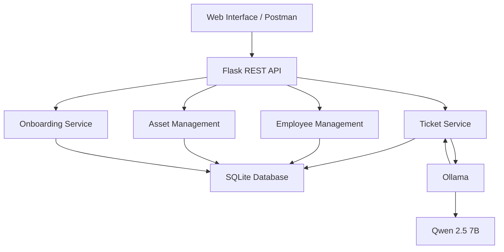

# IT-Automation-POC

## Objective

Demonstrate AI-assisted automation of common IT business processes through a REST API and web interface.

The goal is to simulate a small IT operations platform capable of automating ticket triage, asset management, and employee onboarding.

## Workflows

### 1. AI Ticket Triage

- Create an IT support ticket
- Analyze the ticket description using a local LLM
- Automatically determine:
  - Category
  - Priority
  - Assigned support team
  - Summary
  - Recommended actions
- Store the AI analysis in the database
- Automatically re-analyze tickets when relevant information such as the title or description is updated

### 2. IT Asset Lifecycle

Manage the lifecycle of IT equipment:

- Create assets
- Assign assets to employees
- Update asset information
- Track asset status
- Return or retire assets

### 3. Employee Onboarding

Automate common IT onboarding tasks for new employees:

- Create onboarding records
- Generate onboarding tasks
- Track task completion
- Assign equipment
- Prepare required IT access and software

## Architecture

