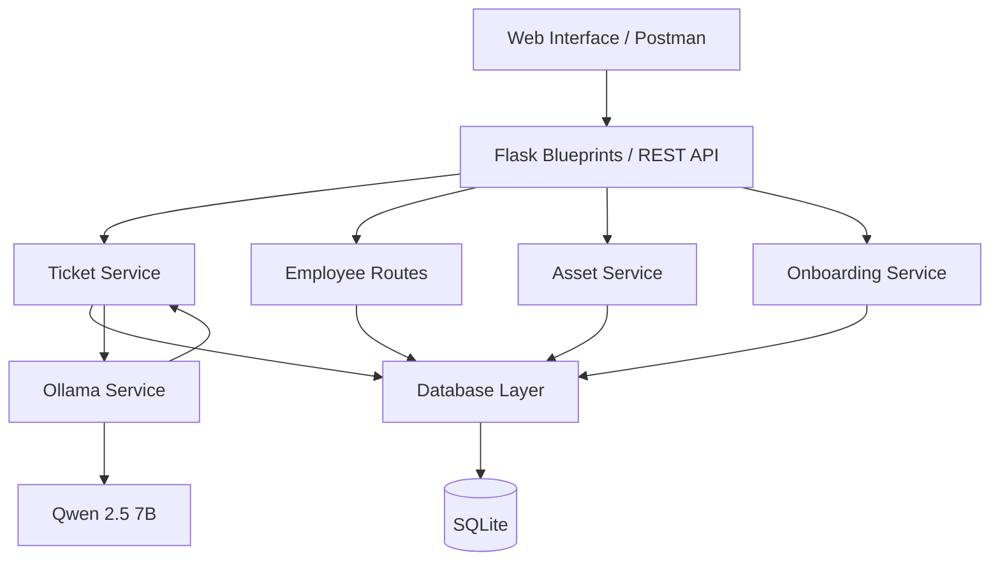

# IT Automation POC

A local proof of concept demonstrating **AI-assisted IT operations automation** through a Flask REST API and web interface.

The application combines traditional Python business logic with a local large language model to automate three common IT workflows:

- AI-assisted ticket triage and technician assignment
- IT asset lifecycle management
- Employee onboarding

## Key Features

### 1. AI Ticket Triage

- Create IT support tickets through the REST API or web interface
- Analyze ticket descriptions using a local LLM
- Automatically determine category, priority, support team, preferred technical role, summary, and recommended actions
- Use Python business logic to select an actual technician based on role suitability and active-ticket workload
- Store the AI analysis and technician assignment in SQLite
- Automatically re-analyze tickets when the title or description changes

### 2. IT Asset Lifecycle

- Create and update assets
- Assign assets to employees
- Track asset status
- Return assets
- Associate assigned equipment with employees

### 3. Employee Onboarding

- Create onboarding records
- Automatically generate standard onboarding tasks
- Track task completion
- Prepare account, access, hardware, and software tasks
- Prevent onboarding completion until all required tasks are completed
- Track completion status and timestamp

### 4. Employee Overview

- View employee information
- View assets assigned to each employee
- View IT tickets assigned to each technician

## Technology Stack

- **Backend:** Python 3 / Flask
- **Database:** SQLite
- **AI:** Ollama with Qwen 2.5 7B
- **Frontend:** HTML, CSS, JavaScript
- **API Testing:** Postman
- **Containerization:** Dockerfile included for portable deployment

## Architecture

The project separates HTTP routing, business logic, database access, and AI integration.



## Project Structure

```text
IT-Automation-POC/
├── app/
│   ├── __init__.py
│   ├── routes/
│   │   ├── ui_routes.py
│   │   ├── employee_routes.py
│   │   ├── ticket_routes.py
│   │   ├── asset_routes.py
│   │   └── onboarding_routes.py
│   ├── services/
│   │   ├── ticket_service.py
│   │   ├── asset_service.py
│   │   ├── onboarding_service.py
│   │   └── ollama_service.py
│   └── database/
│       ├── connection.py
│       ├── employees.py
│       ├── tickets.py
│       ├── assets.py
│       ├── onboarding.py
│       ├── seed.py
│       └── schema.sql
├── data/
│   └── automation.db
├── init_db.py
├── Dockerfile
├── requirements.txt
└── README.md
```

## AI Assignment Approach

The LLM performs **analysis and recommendation**, while Python retains control over the final employee assignment.

```text
Ticket
  ↓
Local LLM analysis
  ↓
Category / Priority / Team / Preferred Role
  ↓
Python validation and employee selection
  ↓
Role suitability + active ticket workload
  ↓
Technician assigned
  ↓
SQLite database
```

This keeps deterministic assignment rules in the application layer rather than allowing the LLM to directly select arbitrary employee records.

## Running Locally

### 1. Create and activate a virtual environment

```bash
python -m venv venv
```

Windows PowerShell:

```powershell
venv\Scripts\Activate.ps1
```

### 2. Install dependencies

```bash
pip install -r requirements.txt
```

### 3. Install and start Ollama

The application expects Ollama with the `qwen2.5:7b` model.

```bash
ollama pull qwen2.5:7b
```

Ensure Ollama is running before testing AI ticket triage.

### 4. Initialize the demo database

> **Warning:** `init_db.py` resets the local database before recreating and seeding it.

```bash
python init_db.py
```

### 5. Start Flask

```bash
flask --app app run --debug
```

Then open the local Flask address displayed in the terminal.

## Web Interface

The POC includes pages for the dashboard, ticket triage, asset management, employee onboarding, and employee overview.

## API

The application exposes REST endpoints for employees, tickets, assets, and onboarding workflows. The Postman collection can be used to demonstrate and test the API independently of the web interface.

## API Documentation

Interactive API documentation is available through Postman:

[View the IT Automation POC API Documentation](https://documenter.getpostman.com/view/36331381/2sBYAuSB6a)

## Docker

A Dockerfile is included to demonstrate how the Flask application can be packaged into a portable container.

The local Ollama service is intentionally kept separate from the Flask application. If Flask is run inside Docker, the Ollama endpoint must be configured so the container can reach the host or another Ollama service instead of relying on the container's own `localhost`.

## Design Principles

- Keep AI analysis separate from deterministic business rules
- Separate Flask routes, service logic, and database access
- Use a local LLM so the POC does not depend on a paid AI API
- Keep the project lightweight with Flask and SQLite
- Make workflows independently testable through REST endpoints
- Maintain a simple architecture suitable for a proof of concept

## Project Status

The core proof of concept is complete:

- AI ticket triage
- AI-assisted technician recommendation with Python-controlled assignment
- IT asset lifecycle workflow
- Employee onboarding workflow
- Employee overview
- Modular database layer
- Flask Blueprint route structure
- Database initialization and demo seeding
- Dockerfile for containerization showcase
